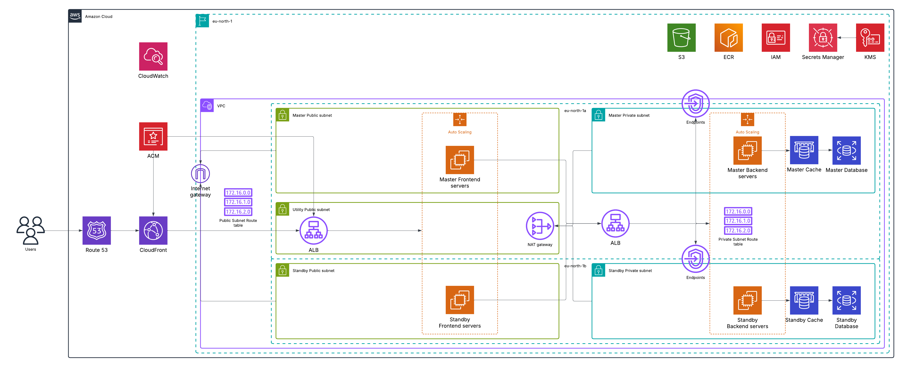

# AWS cloud infrastructure architecture

## Explanations
### Region and VPC
eu-north-1 \(in Stockholm\) was chosen because it's the nearest, 2 Availability Zones were chosen for high availability of frontend and backend servers \(RDS and ElastiCache would be multiplicated too but Free Tier does not include it\).\
VPC consists of 2 public subnets in 2 different availability zones, one is for master services, the other is for standby frontend servers, private networks are organised in the same way as public ones.
### Security Groups TODO
### IAM users, roles, permissions TODO
All actions will be taken from IAM user account.
### Secrets Manager and KMS
Secrets Manager will manage secrets for backend application and RDS database.\
KMS will manage any needed keys for Secrets Manager and used services \(mainly AWS-managed keys\).
### ACM
ACM will manage free, public certificates for CloudFront and ALB in public network.
### Route Tables
Route Tables are divided on Public and Private where both handle local network traffic and also public table routes to Internet Gateway and private table routes to NAT Gateway.
### Internet Gateway
Internet Gateway will allow public subnets for communication with internet.
### NAT Gateway
NAT Gateway will be located in master public subnet and serve for private subnets to connected them internet. If NAT Gateway won't be needed it will be removed because of costs.
### VPC Endpoints
VPC Endpoints will be used for connecting services in private \(maybe in public too\) subnets \(EC2, RDS, ElastiCache\) to regional services \(ECR, KMS, Secrets Manager\).
### Bastion for private subnets? TODO
### ALBs
Application Load Balancers will be used to distribute traffic in EC2's Auto Scaling Groups.
### CloudWatch
CloudWatch monitors and observes all services with defined up to 10 alarms when something goes wrong.
### Auto Scaling
Frontend and backend Free-Tiered EC2 servers will use Docker to host applications.\
They will be auto-scaled from 1 to 2 instances based on CPU/memory usage of a master instance. Auto scaling will be distributed between 2 AZs. Maybe some Spot Instances will be used.
### Route 53
DNS will route domain name \(if bought or obtained\) to CloudFront.
### CloudFront
CDN will be used for distributing website across the web. Origin will be sources from public ALB.
### ECR
ECR will be used for storing frontend and backend Docker images and serving them for EC2 instances.
### ElastiCache
One cache.t3.micro node ElastiCache \(ValKey, Redis or Memcached\) will be used for caching RDS database responses.
### RDS
PostgreSQL single-AZ db.t4g.micro instance with 20 GiB of gp2 storage will be used for database services for application.
